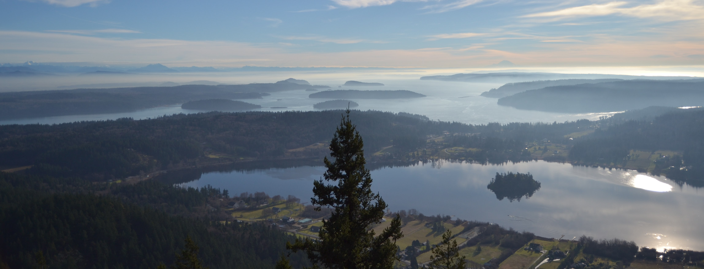
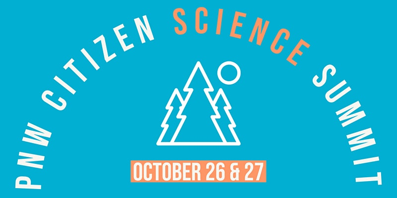
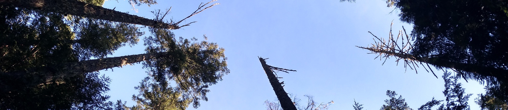

<!-- Global site tag (gtag.js) - Google Analytics -->
<script async src="https://www.googletagmanager.com/gtag/js?id=UA-44627976-9"></script>
<script>
  window.dataLayer = window.dataLayer || [];
  function gtag(){dataLayer.push(arguments);}
  gtag('js', new Date());
  gtag('config', 'UA-44627976-9');
</script>


```{r setup, include=FALSE}
knitr::opts_chunk$set(echo = TRUE)
```


```{r include=FALSE}
library(git2r)
library(tidyverse)
library(knitr)
library(kableExtra)
```





> 

# Upcoming Event! 

*RSVP [here](https://forms.gle/fCqouVBdTyW7xnUW8) by May 20th!*

## Pacific Northwest Citizen Science - Networking Evening at Woodland Park Zoo! 

**Join us for a Project Fair and Networking Event at Woodland Park Zoo on May 25th!** 

Do you lead a scientific research project that involves participation by volunteers? Do you coordinate volunteers to participate in a scientific research project? Do you participate as a volunteer in a scientific research project? Whether you call it community science, citizen science, public participation in scientific research or something else, if this is a focus and/or interest of yours, we invite you to join this regional networking event! 

This event complements the concurrent national [C*Sci22 conference](https://citizenscience.org/c-sci-2022/) (but registration for the national event is not required to attend this regional gathering). This event also serves as a lead-up to a regional Pacific Northwest Citizen Science Summit being planned for October 2022 to be held in the Portland, OR area with virtual participation options (dates TBD). 

### Details

What: **Pacific Northwest Citizen Science - Networking Evening at Woodland Park Zoo**

When: **Wednesday, May 25 from 4:00 to 7:30 p.m. **

Where: **Woodland Park Zoo (enter via the zoo’s West Entry) **

RSVP (*required by May 20th!*): https://forms.gle/fCqouVBdTyW7xnUW8
 
 
### Agenda: 

4:00 – 6:00 p.m. PNW Citizen Science Mini-Fair & Reception (Near the zoo’s North Meadow, Food and drink provided.)


Break 

6:30 – 7:30 p.m. PNW Citizen Science Breakout Discussions  (Center for Wildlife Conservation Boardroom, Dessert, coffee & tea provided) 

\  

***


# Welcome
Welcome to pnwcitsci.org! The purpose of this webpage is to highlight the many *active* citizen science projects in the region, connect project leaders, and share resources. 

\  

***
## Mailing-list

Want to connect with other citizen science project leaders in the region? Subscribe to the [mailing-list](https://groups.io/g/pnwcitsci) by visiting the [Groups.io page (https://groups.io/g/pnwCitSci)](https://groups.io/g/pnwCitSci) or by emailing the subscribe email listed below: 

* Group Email Addresses
  +  Post: pnwCitSci@groups.io
  +  Subscribe: pnwCitSci+subscribe@groups.io
  +  Unsubscribe: pnwCitSci+unsubscribe@groups.io
  +  Group Owner: pnwCitSci+owner@groups.io
  +  Help: pnwCitSci+help@groups.io
  
Note that you do *not* need a groups.io account to subscribe.

**Feel free to email the list to introduce yourself, ask questions, or share updates and resources.** 

\  

***

## Citizen Science

Citizen science is a term for research championed by people without formal scientific backgrounds. 

**Every person is a citizen of the world.**

>"We are curious because we all have a little bit of scientist in us. Citizen science projects provide opportunities for us to release that inner scientist." - JM Hulbert

There are many opportunities for anyone to contribute to scientific research. For example, the University of Washington's [Center for Game Science](http://centerforgamescience.org/) hosts many exciting games and puzzles that provide fun ways to advance knowledge.

* Check out [Foldit](https://fold.it/) or [Mozak](https://www.mozak.science/landing) to solve helpful puzzles about protein folding or neural networks, respectively. 

* Check out [OrcaSound](https://www.orcasound.net/listen/) to listen for and document interesting underwater sounds.

\  

***


## Upcoming 2022 Summit

Want to join the planning team for the 2022 PNW Citizen and Community Science Summit? Let us know by contacting [JM Hulbert](https://jmhulbert.github.io).

This event is organized by people involved with Pacific Northwest Citizen Science
https://pnwcitsci.org/, representing the Washington Invasive Species Council, Western Invasives Network, Washington State University and Woodland Park Zoo 

\  

***

## Previous Events

### *2021 PNW Citizen & Community Science Summit*  (October 26-27, 2021). 

{width=50%}

The [event](https://www.eventbrite.com/e/pnw-citizen-science-summit-tickets-167104687619) was co-organized by the Washington Invasive Species Council, Western Invasives Network, Whatcom County Amphibian Monitoring Program, Woodland Park Zoo, Washington State University and the National Park Service.

#### **Program**

The 2021 Summit featured more than 30 presentations from local projects throughout the Pacific Northwest.

[2021 Summit Agenda (PDF)](./files/10.25.21 PNW CitSci Summit Final Agenda v2.pdf)

#### **Abstracts**

[2021 Summit Abstracts (PDF)](./files/PNW CitSci Summit Abstracts v3.pdf)

Thank you to everyone who submitted an abstract for the 2021 event. 

***


## Outdoor Citizen Science Projects in the Pacific Northwest

Below is a list of outdoor citizen science projects active in the Pacific Northwest (not exhaustive, under constant revision). Please send suggestion changes to [JM Hulbert](mailto:hulbe@wsu.edu).

```{r echo=FALSE}
ProjectList <- read.csv("./files/data/Project List.csv")
ProjectList <- arrange(ProjectList,desc(Scope))
```

```{r echo=FALSE}
kable(ProjectList) %>% kable_styling(c("striped", "hover", "condensed", "responsive", font_size = 5,fixed_thead=TRUE)) %>% column_spec(1, bold = T,border_right = T, width_min="11em") %>% column_spec(3, width_min="11em")  %>% column_spec(4, width_min="14em") %>% scroll_box(width = "95%") 
```
\ 

#### University Extension Programming
Many land grant universities in the region offer programming and opportunities to learn and contribute to research. 

* Check out the below programs for more information:
  + Washington
    + [Washington Master Gardener Program](http://mastergardener.wsu.edu/) 
  + Oregon
    + [Oregon Master Gardener Program](https://extension.oregonstate.edu/mg)
    + [Oregon Master Naturalist Program](https://extension.oregonstate.edu/mn)
    + [Oregon Master Woodland Manager Program](https://extension.oregonstate.edu/mwm)
  + Alaska 
    + [Alaska Master Gardener Program](https://www.uaf.edu/ces/garden/mastergardeners/)

#### City Nature Challenge
Every year from April 30 - May 3, cities and counties participate in the City Nature Challenge on [iNaturalist](https://inaturalist.org). 

* Check the list below for a project near you:
  + [City Nature Challenge: Seattle-Tacoma Metro](https://www.inaturalist.org/projects/city-nature-challenge-2021-seattle-tacoma-metropolitan-area)
  + [City Nature Challenge: Greater Portland-Vancouver Metro](https://www.portland.gov/parks/nature/events/2021/4/30/city-nature-challenge)
  + [City Nature Challenge: Bonner County, ID](https://www.inaturalist.org/projects/city-nature-challenge-2021-bonner-county-id)


\

***

### Improve this webpage

This webpage and the project list above are hosted in a github repository.

Anyone is welcome to collaborate to add or make changes to the github repository (https://github.com/jmhulbert/pnwcitsci). The content on this page is compiled using R Markdown, but the project list is maintained as a .csv file.

* As a repository collaborator:
  + You are welcome to clone the repository to your system and work from the R Project (pnwcitsci.Rproj) file in Rstudio or you can make changes to the ProjectList.csv file (files/data/ProjectList.csv).
  + You can also make changes directly to the .csv file through your browser.
  + Or you can make changes by downloading the .csv file, altering, committing and pushing it back to the repository.

Note that you need a github account to collaborate or make changes. Feel free to contact [JM Hulbert](mailto:hulbe@wsu.edu) for additional details or instructions. You can also contact [JM Hulbert](mailto:hulbe@wsu.edu) to request an addition or change. 

*Note that the Markdown (index.Rmd) file will need to be knit before the changes will be visible on this webpage.*


\  

***



\  

***
### More Information
Please contact [JM Hulbert](https://jmhulbert.github.io) with any questions or suggestions for the PNW Citizen Science webpage. 

### Local Resources

+ Reports
  + [Puget Sound Citizen Science Summit 2018 Report](https://ptmsc.org/uploads/pdf/Science/citizen_science/2018%20Puget%20Sound%20Summit%20Report_4-9-2018%20orig%20size.pdf)

* Guides for Citizen Scientists
    + [Scientific literacy for the citizen scientist](https://pubs.extension.wsu.edu/scientific-literacy-for-the-citizen-scientist), Washington State University Extension.
    + [A citizen science guide to wild bees and floral visitors in western Washington (Home Garden Series)](https://pubs.extension.wsu.edu/a-citizen-science-guide-to-wild-bees-and-floral-visitors-in-western-washington-home-garden-series), Washington State University Extension.

* Online Courses and Webinars
    + [Oregon Forest Pest Detectors](https://extension.oregonstate.edu/ofpd), Oregon State University Extension Service.
    + [Pest Scene Investigator: a Training Curriculum](https://catalog.extension.oregonstate.edu/em9161), Oregon State University Extension Service.

More information coming soon

\  

***

\

### Technical Literature

* Publications
    + Taylor SD, Meiners JM, Riemer K, Orr MC, White EP. [Comparison of large‐scale citizen science data and long‐term study data for phenology modeling](https://andrewsforest.oregonstate.edu/publications/5081). Ecology. 2019 Feb;100(2):e02568.
    
More information coming soon
