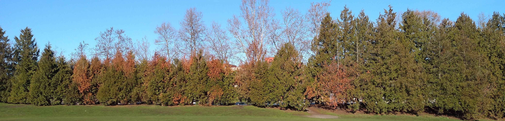

```{r setup, include=FALSE}
knitr::opts_chunk$set(echo = TRUE)
```


```{r include=FALSE}
library(git2r)
library(tidyverse)
library(knitr)
library(kableExtra)
```

# Welcome
This is the landing page for the Forest Health Defenders program. 

## Citizen Science

>We all have a little bit of scientist in us, it is reason we are curious. 

Here you can release your inner scientist by joining us to advance knowledge and keep trees healthy in the PNW.

Citizen science is a term for research championed by people without formal scientific backgrounds. 

#### The Research

Trees are ecologically, culturally and economically important to the PNW. The objective of this program is to coordinate open research to keep trees healthy. 

#### Become a Forest Health Defender

Stay tuned for more information about how to get involved or contribute to the research. 

# Coming Soon
We are currently in the process of securing financial support for this program. 

Please check back again soon. 

## Forest Health Concerns {.tabset .tabset-fade}

### Western redcedar decline (pilot project)



#### *Concern*

Many reports have expressed concern about the increased levels of western redcedar (*Thuja plicata*) decline in the PNW. 

* Recent Reports
    + Newsletters
        + Portland Parks and Recreation, 2019. [Urban Forest Health: western redcedar and drought](https://t.e2ma.net/webview/8zhozb/bac0681ea11fe0ffea11d10bc67012bd), Urban Forestry, Tree Bark Number 1, August 2019.
        + WSU Extension, 2018. [Forester's Notes - Western Redcedar](http://forestry.wsu.edu/nps/newsletter/2018july/#focus), Washington State University, North Puget Sound Extension Forestry E-Newsletter, Volume 11, Number 2, July 2018.
    + Articles
        + O'Neill E. 2019. ['Dead tree after dead tree.' The case of Washington's dying foliage](https://kuow.org/stories/dead-tree-after-dead-tree-the-case-of-the-dying-hemlocks-and-cedars-and-maples), KUOW, September 17, 2019.
        + Vikander T. 2019. [Western red cedars are dying of drought in Vancouver and scientists say it’s one more portent of climate change](https://www.thestar.com/vancouver/2019/06/13/western-red-cedars-are-dying-of-drought-in-vancouver-and-scientists-say-its-one-more-portent-of-climate-change.html), The Star, Vancouver, June 13, 2019.
        + Wilson C. 2018. [Summer drought deals ‘devastating loss’ to western red cedar, B.C.’s official tree](https://www.timescolonist.com/news/local/summer-drought-deals-devastating-loss-to-western-red-cedar-b-c-s-official-tree-1.23428047), Times Colonist, September 12, 2018.
    + Blog Posts
        + **Fischer M. J. 2019.  [Western Redcedar East of the Cascades: A Species in Decline?](https://sflonews.wordpress.com/2019/12/04/western-redcedar-east-of-the-cascades-a-species-in-decline/) Washington State Department of Natural Resources, Small Forest Landowner News, December 4, 2019.**
        + Rippey, C. 2018.  [Western redcedar die-off in Seattle Parks](https://www.greenseattle.org/western-redcedar-die-off-in-seattle-parks/). Green Seattle Partnership, Restoration Resources, July 24, 2018.
        
#### *Importance*

* The western redcedar (*Thuja plicata*) is critically important to protect because of its ecological, cultural and economic value.
    + This species grows widely throughout the PNW because of its tolerance to shade, flooding and nutrient poor soils. 
    + Here, it provides habitat and nourishment for many mammal and bird species and has high commercial value because of its durability and resistance to wood rotting fungi. 
    + It is also used widely in restoration activities locally and as an ornamental species internationally. 
    + *Thuja plicata* is also considered a Cultural Keystone Species because its multiple uses and value to indigenous American peoples. 

> Therefore, conserving *T. plicata* is a critically important for protecting our cultural heritage, timber economy and forest ecosystems of the PNW.

#### *Research*

Join us to map the extent of the decline and determine if it is entirely linked to recent climate data or if there are other biotic factors involved (e.g. insect pests or diseases).


#### *How to contribute*

Check back soon for space to share observations of healthy and unhealthy western redcedar trees. 

### Other Forest Health Concerns?


```{r include=FALSE}
#### Swordfern dieback

#### *Concern*
#### *Importance*
#### *Research*
#### *How to contribute*

### Alder root rot

#### *Concern*
#### *Importance*
#### *Research*
#### *How to contribute*

### Bigleaf maple dieback

#### *Concern*
#### *Importance*
#### *Research*
#### *How to contribute*

```

Let us know if there are other forest health issues you would like to learn more about or see more research for. 

If we can generate enough support, we would also like to design projects about the bigleaf maple decline, swordfern dieback and alder root rot. 

##

# More Information
Please contact [JM Hulbert](josephmichaelhulbert@gmail.com) for more information about the Forest Health Defenders program. 

More information about current citizen science opportunities in forest health is available on the webpage for the [Forest Health Citizen Science Community](https://fhcs.page).

# Power This Program
Please contact [JM Hulbert](josephmichaelhulbert@gmail.com) if you are interested in supporting this program. We would be happy to co-develop a project and help champion your ideas to keep trees healthy. 
